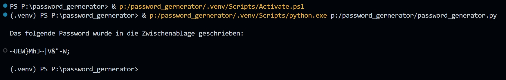

# Password generator

## password_generator.py

Dieser Code definiert eine Funktion `generate_password()`, die ein zufälliges Passwort basierend auf bestimmten Kriterien erstellt. Das Passwort kann Klein- und Großbuchstaben, Zahlen und Sonderzeichen enthalten. Die Funktion akzeptiert mehrere optionale Parameter:

- `length`: Gibt die Länge des Passworts an. Standardmäßig sind es 12 Zeichen.
- `include_digits`: Gibt an, ob Zahlen im Passwort enthalten sein sollen. Standardmäßig ist `True`.
- `include_special_chars`: Gibt an, ob Sonderzeichen im Passwort enthalten sein sollen. Standardmäßig ist `True`.
- `exclude_chars`: Gibt an, ob häufig verwechselte Zeichen ('i', 'l', '1', 'L', 'o', '0', 'O') aus dem Zeichensatz ausgeschlossen werden sollen. Standardmäßig ist `True`.

Die Funktion überprüft zuerst, ob die gewünschte Passwortlänge mindestens 8 Zeichen beträgt. Dann definiert sie einen Grundzeichensatz aus Groß- und Kleinbuchstaben. Wenn `exclude_chars` `True` ist, werden die in `exclude_chars` angegebenen Zeichen aus dem Zeichensatz entfernt. Wenn `include_digits` oder `include_special_chars` `True` sind, werden die entsprechenden Zeichen dem Zeichensatz hinzugefügt.

Die Funktion generiert dann ein Passwort, indem sie zufällig Zeichen aus dem modifizierten Zeichensatz auswählt, und gibt das generierte Passwort zurück.

Schließlich wird ein Passwort mit der `generate_password()`-Funktion und spezifischen Parametern generiert. Das generierte Passwort wird mit `pyperclip.copy()` in die Zwischenablage kopiert und in der Konsole ausgegeben.

Bitte beachten Sie, dass `pyperclip` verwendet wird, um das Passwort in die Zwischenablage zu kopieren. Sie sollten das Modul `pyperclip` installiert haben, damit dieser Code ordnungsgemäß funktioniert.

